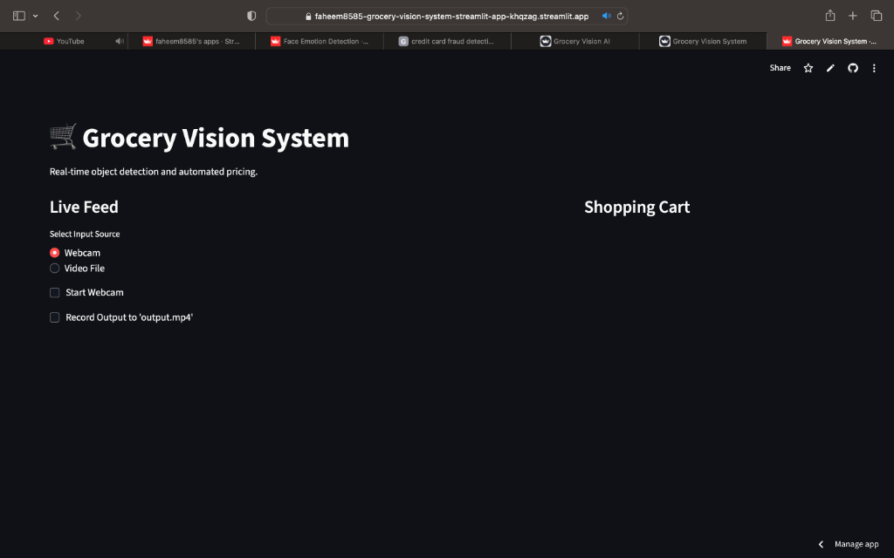
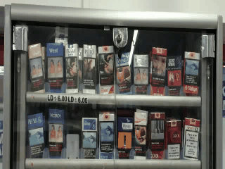

# End-to-End Grocery Vision Pipeline
**Developer: Faheem**

This project implements a complete pipeline for grocery item detection and pricing, using YOLOv8 and Flask.

## Demo

### UI Screenshot


### Live Detection


## Project Structure

- `data/`: Dataset directory (train/valid/test).
- `models/`: Trained models.
- `scripts/`: Helper scripts.
- `train.py`: Script to train YOLOv8 on your custom dataset.
- `inference.py`: Real-time webcam detection with price overlay.
- `app.py`: Flask API for deploying the model.
- `prices.json`: Configuration file mapping product names to prices.

## Setup

1.  **Install Dependencies**:
    ```bash
    pip install -r requirements.txt
    ```

2.  **Prepare Data**:
    - Organize your dataset in `data/` following the YOLO structure.
    - Create `data/dataset.yaml` pointing to your train/val paths.

## Usage

### 1. Training
To train a custom model on your dataset:
```bash
python train.py
```
This will save the best model to `models/grocery_detection/weights/best.pt`.

### 2. Real-Time Inference (Webcam)
To run detection on your webcam with price overlay:
```bash
python inference.py
```
*Note: Press 'ESC' to exit.*
*Tip: You can find a sample test video at `data/test_video/test_run_video.mp4`.*

### 3. Deployment (API)
To start the Flask API server:
```bash
python app.py
```
The API will be available at `http://localhost:5000/predict`.

**Test the API:**
```bash
curl -X POST -F "image=@/path/to/image.jpg" http://localhost:5000/predict
```

## Configuration
- **Prices**: Update `prices.json` to change product prices.
- **Model**: By default, scripts use `yolov8n.pt`. Update the model path in `inference.py` and `app.py` to point to your trained model (e.g., `models/grocery_detection/weights/best.pt`).
